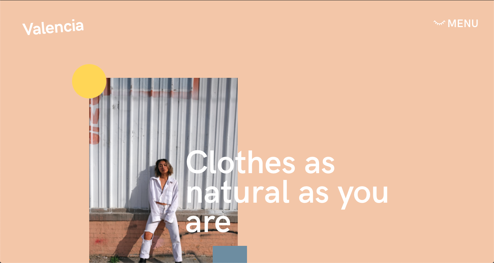
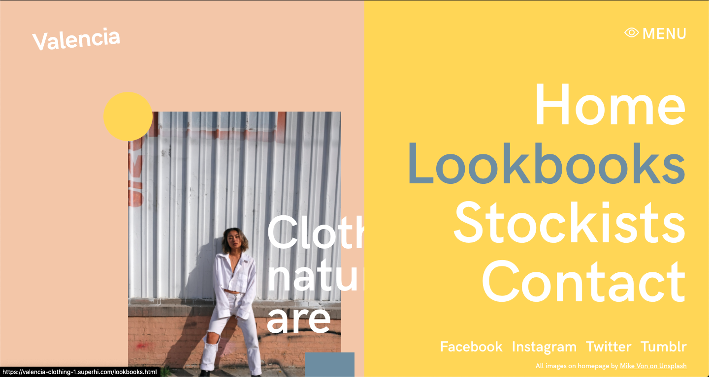
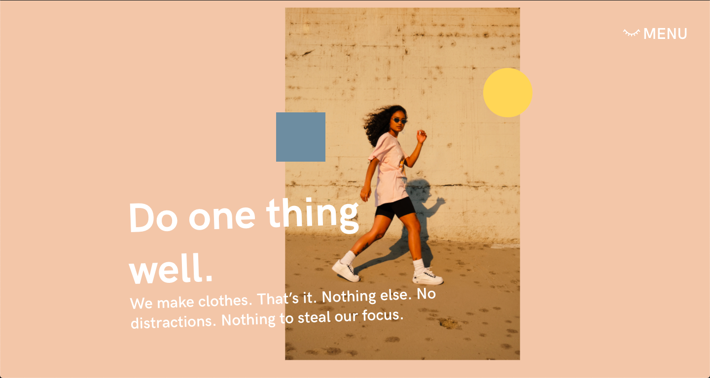

# Valencia Clothing
Site for clothing brand Valencia.

## Table of contents
* [General info](#general-info)
* [Screenshots](#screenshots)
* [Technologies](#technologies)
* [Demo](#demo)
* [Features](#features)
* [Status](#status)
* [Contact](#contact)

## General info
This was the sixth homework project on the [Superhi Foundation](https://superhi.com/courses/html-css-javascript-foundation) course. It is a redesign of the main project of the week, [Baker + Brown](https://github.com/guybroadhurst/baker-brown-clothing).

## Screenshots

## Technologies
* HTML5
* CSS3
* jQuery v3.5.1

## Demo
[Live Demo](https://valencia-clothing-1.superhi.com/)

## Features
List of features:
* Slide out menu
* Hover transform effects.

## Status
Project is: _finished_ and complete for the course.
 
## Contact
Created by [@guybroadhurst](https://www.guybroadhurst.co.uk/) - feel free to contact me!
